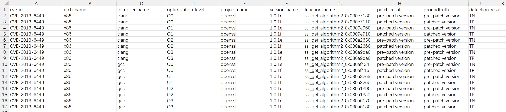

# Lares

The code and dataset of the paper are at [https://anonymous.4open.science/r/Lares-DDDA](https://anonymous.4open.science/r/Lares-DDDA).

We introduce Lares, a novel patch presence testing framework, to verify whether 1-day vulnerabilities are patched. 

- Input: Binary to be detected, Project source path, and Patch diff file.
- Output: Whether the vulnerability is patched.

<br><br>

## 1. Introduction
- The directory code/ contains the complete code of the paper.
- The binaries are at [cross-opti](https://drive.google.com/file/d/1I_JPMhFMZ2axCpy3lRxxb_YpcS8ZjztZ/view?usp=drive_link) and [cross-arch](https://drive.google.com/file/d/120O1XOhSMLEs6PCozT6RNmIMVtOOTsoE/view?usp=drive_link) (Google Drive). The patch dataset are at _/patch/_

  
<br><br>

## 2. Quick reproduction of the code

#### 2.1 Download the Pre-prepared examples

- The code with pre-prepared examples is here (Google Drive). Download and unzip it.
- Download the required pip packages.

#### 2.2 Have a quick start
```
python3 7_patch_verification.py
python3 8_calculate_score.py
```
#### 2.3 Expected results


<br><br>

## 3. Full process

#### 3.1 Prepare the datasets
- put the binaries at _code/dataset/bin/_
- put the patches at _code/dataset/patch/src/_
```
python3 1_patch_preprocess.py
```
- Build new path _code/data/CVE-XXXX_XXXX_{function_name} for every vulnerability (such as "CVE-2013-6449_ssl_get_algorithm2_1").
- Put the generated results in _code/dataset/patch/sig/_ to the new path and rename as "result.json".
```
python3 2_source_preprocess.py
python3 3_source_binary_code.py
```

#### 3.2 Run Lares
```
python3 4_source_enhance.py
python3 5_patch_detection.py
python3 6_reverse_detection.py
python3 7_patch_verification.py
python3 8_calculate_score.py
```

